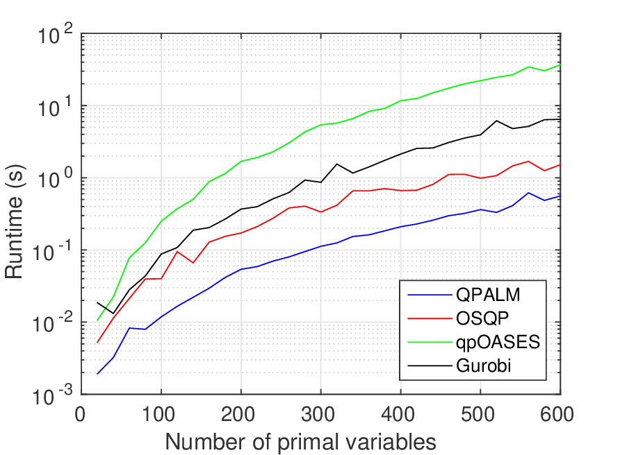

# QPALM

[](https://travis-ci.com/Benny44/QPALM)

A proximal augmented Lagrangian method for QPs using semismooth Newton direction and exact line search.

## Installation

* To install the mex interface of QPALM, add QPALM and its subfolders to the matlab path. Then run qpalm_make.m
* To install a C-callable library, compile suitesparse, see [here](https://github.com/jluttine/suitesparse). Then run compile the QPALM directory. For this you need to link to the BLAS and LAPACK libraries on your computer. You can use BLAS= and BLAS_PATH= options in the make command. For example:
```
make BLAS="-lmwblas -lmwlapack" BLAS_PATH=$(HOME)/.Matlab/R2015/bin/glnxa64
```
* To use the Matlab version of QPALM, compile the CHOLMOD mex functions (suitesparse/CHOLMOD/MATLAB/cholmod_make.m), and run QPALM/matlab/mex/PWAlinesearch_setup.m.

## Code Example

Basic demos are available for the different ways to call the solver.
* For the mex interface of QPALM, check out examples/qpalm_mex_demo.m.
* For the C-version of QPALM, check out examples/qpalm_demo.c.
* For the matlab version of QPALM, check out examples/qpalm_matlab_demo.m.

## Documentation

You can now find the the documentation [online](https://benny44.github.io/QPALM/).

## Tests

To run the automated tests, do
```
make test BLAS=... BLAS_PATH=...
```

## Benchmarks (random QPs)



## Contributors

* **Ben Hermans** - *Main developer*
* **Panagiotis Patrinos** - *Codeveloper*
* **Andreas Themelis** - *Theoretical contributions*
## License

TBA
